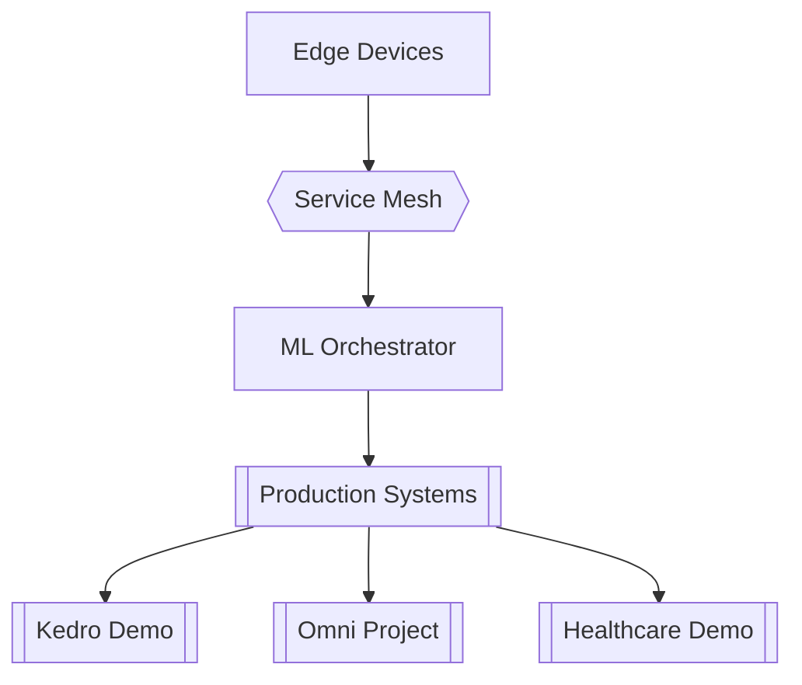

<!-- LANGUAGE SWITCHER -->

  
  
  

# 🌐 Internet of Production-Ready Services

**Building Africa's AI Infrastructure** at [TMG Makerspace](https://tmgmakerspace.africa)  

  
  
  
  

  

  <video width="320" height="240" controls>
    <source src="https://example.com/path-to-your-demo-video.mp4" type="video/mp4">
    Your browser does not support the video tag.
  </video>

 

<h2 align="center">🎯 Mission</h2>

<strong>We're not just reducing technical debt – we're eliminating it.</strong> Based at TMG Makerspace Africa, we're revolutionizing how data science experiments transform into production systems. Our solutions are battle-tested in the challenging South African context, making them resilient enough for any environment.

 

<h2 align="center">💥 What Sets Us Apart</h2>

⚡ <strong>Zero-Compromise ML Ops</strong>: Production-ready from day one

⚡ <strong>Ruthless Efficiency</strong>: Cut experiment-to-production time by 60%

⚡ <strong>Built for Africa</strong>: Designed for our unique infrastructure challenges

⚡ <strong>Scale-Ready</strong>: From prototype to continental deployment

 

<h2 align="center">🛠️ Game-Changing Solutions</h2>

🔧 <strong>Experiment Management</strong>: Version control that actually works for data science

🔧 <strong>Quality Enforcement</strong>: Automated guardrails for technical excellence

🔧 <strong>Self-Healing Pipelines</strong>: Adaptive infrastructure that grows with you

🔧 <strong>Resource Optimization</strong>: Maximum impact, minimum waste

🔧 <strong>Production-Grade ML</strong>: Deploy with absolute confidence

  <em>Building Africa's AI Future</em>

 

<h2 align="center">⚡ Power Tools</h2>

  
  
  
  
   
  
  
  
  
  
  
  
  
  
  
  
  

 

<h2 align="center">🚀 Flagship Solutions</h2>
<table align="center">
  <tr>
    <th>Solution</th>
    <th>Description</th>
  </tr>
  <tr>
    <td>⚡ <strong>4o Experiment Manager</strong></td>
    <td>The last ML experiment tracker you'll ever need</td>
  </tr>
  <tr>
    <td>🛡️ <strong>Technical Debt Shield</strong></td>
    <td>Stop technical debt before it starts</td>
  </tr>
  <tr>
    <td>🔥 <strong>Production Pipeline Builder</strong></td>
    <td>From notebook to production in minutes, not months</td>
  </tr>
  <tr>
    <td>📊 <strong>Analytics Command Center</strong></td>
    <td>Total visibility into your ML operations</td>
  </tr>
  <tr>
    <td>⚡ <strong>Resource Optimizer</strong></td>
    <td>Maximum performance, minimum spend</td>
  </tr>
  <tr>
    <td>🧩 <strong>Project IDX</strong></td>
    <td>Integrated development experience for seamless collaboration and deployment</td>
  </tr>
  <tr>
    <td>🖼️ <strong>pix2tex</strong></td>
    <td>Using a ViT to convert images of equations into LaTeX code</td>
  </tr>
</table>

 

<h2 align="center">🌍 Our Impact Zone</h2>

🏢 <strong>Home Base</strong>: TMG Makerspace Africa - Where Innovation Lives

🌍 <strong>Territory</strong>: Leading South Africa's AI Revolution

🎯 <strong>Target</strong>: Making Johannesburg the AI Hub of Africa

💡 <strong>Innovation HQ</strong>: Transwerke, Braamfontein - The Heart of Tech

 

<h2 align="center">🏆 Victories & Validation</h2>

  

    
Click to see what excellence looks like

     
    <ul>
      <li>🎓 <a href="https://learn.microsoft.com/en-us/certifications/azure-ai-engineer/">Microsoft Azure AI Engineer Associate</a></li>
      <li>🎓 <a href="https://learn.microsoft.com/en-us/certifications/azure-solutions-architect/">Microsoft Certified: Azure Solutions Architect Expert</a></li>
      <li>🎓 <a href="https://www.isc2.org/Certifications/CISSP">Certified Information Systems Security Professional (CISSP)</a></li>
      <li>🏆 <a href="https://www.redbull.com/za-en/events/red-bull-basement">Red Bull Basement National Finalist 🇿🇦</a></li>
      <li>⚡ <a href="https://www.microsoft.com/startups/founders-hub">Microsoft Founders Hub - Level 3</a></li>
      <li>🎓 <a href="https://learn.microsoft.com/en-us/certifications/azure-fundamentals/">Microsoft Certified: Azure Fundamentals</a></li>
      <li>🎓 <a href="https://learn.microsoft.com/en-us/certifications/azure-ai-fundamentals/">Microsoft Certified: Azure AI Fundamentals</a></li>
      <li>🎓 <a href="https://learn.microsoft.com/en-us/certifications/power-platform-fundamentals/">Microsoft Certified: Power Platform Fundamentals</a></li>
      <li>🚗 <a href="https://aws.amazon.com/deepracer/">AWS DeepRacer Championship Participant</a></li>
      <li>☁️ <a href="https://aws.amazon.com/certification/certified-cloud-practitioner/">AWS Cloud Practitioner</a></li>
      <li>🎓 <a href="https://www.microsoft.com/en-us/learning/mcsd-sql-2016-certification.aspx">Microsoft Certified Solutions Developer (MSCD): SQL Server 2016</a></li>
    </ul>
  

 

<h2 align="center">💻 Programming Languages</h2>

  
  
  
  
  
  
  

 

<h2 align="center">📊 GitHub Stats</h2>

  

 

<h2 align="center">🤝 Join the Revolution</h2>

  
  
  
  

   
  🏢 <a href="https://g.co/kgs/CKQ5KiE">Transwerke, Braamfontein, Johannesburg, 2017</a>
   
  🚀 Innovation Hub: <a href="https://tmgmakerspace.africa">tmgmakerspace.africa</a>
    
  
    
  

