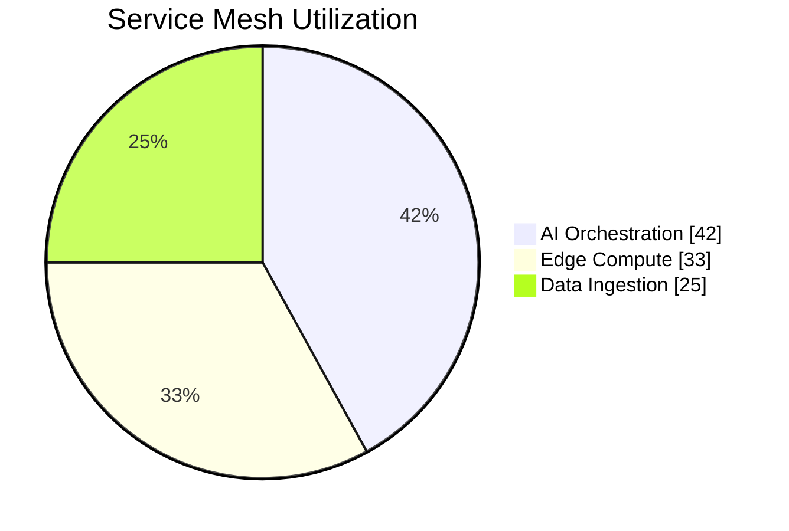

<h1 align="center">
  🌍 Industrial-Grade AI Services
   
  Powered by TMG Makerspace Africa
</h1>

  
  
  
  

## 👋🏾 Hi, I'm Sudhir!

Welcome to my GitHub! I'm passionate about transforming data science experiments into production-ready solutions, particularly in the challenging and diverse context of Africa. At TMG Makerspace Africa, I build resilient AI infrastructures designed for real-world implementation.

  
  
  

## 🎯 Mission

**Eliminating technical debt, not just reducing it.** Based at TMG Makerspace Africa, we're revolutionizing how data science experiments transform into production systems. Our solutions are battle-tested in South Africa's challenging context, ensuring resilience in any environment worldwide.

## 💥 What Sets Us Apart

- ⚡ **Zero-Compromise MLOps**: Production-ready from day one
- ⚡ **Ruthless Efficiency**: 60% faster experiment-to-production time
- ⚡ **Built for Africa**: Engineered for our unique infrastructure challenges
- ⚡ **Scale-Ready**: Seamless scaling from prototype to continental deployment

## 🚀 Flagship Solutions

| Solution | Description |
|----------|-------------|
| ⚡ **4o Experiment Manager** | The definitive ML experiment tracker for enterprise deployment |
| 🛡️ **Technical Debt Shield** | Proactive technical debt prevention system |
| 🔥 **Production Pipeline Builder** | Transform notebooks to production in minutes, not months |
| 📊 **Analytics Command Center** | Complete visibility across ML operations |
| ⚡ **Resource Optimizer** | Maximize performance while minimizing resource usage |
| 🧩 **Project IDX** | Integrated development experience for seamless collaboration |
| 🖼️ **pix2tex** | Vision Transformer converting equation images to LaTeX code |

## 🛠️ Core Technology Stack

| **Category** | **Technologies** |
|--------------|------------------|
| **MLOps** | Kedro • MLflow • Kubeflow • TensorFlow Extended |
| **Cloud Native** | AWS IoT Greengrass • Azure Arc • Google Anthos |
| **Data Fabric** | Delta Lake • Apache Iceberg • AWS Glue |
| **Security** | HashiCorp Vault • AWS IAM • Azure Sentinel |

## 📈 Service Distribution

## 🌍 Impact Areas

- 🏢 **Database Management Systems**: Enterprise-grade DBMS with POPIA compliance
- 🌍 **MySQL Services**: Optimized MySQL solutions for African businesses
- 🎯 **PostgreSQL Services**: Advanced PostgreSQL implementations with high availability
- 🤖 **AI Integration**: Custom AI solutions for unique African challenges

## 🛠️ Technology Expertise

  
  
  
  
   
  
  
  
  
   
  
  
  
  

## 🚀 Live Demos

  
  

## 🏆 Certifications & Achievements

  
<strong>View Certifications & Achievements</strong>

  
  - 🎓 [Microsoft Azure AI Engineer Associate](https://learn.microsoft.com/en-us/certifications/azure-ai-engineer/)
  - 🎓 [Microsoft Certified: Azure Solutions Architect Expert](https://learn.microsoft.com/en-us/certifications/azure-solutions-architect/)
  - 🎓 [Certified Information Systems Security Professional (CISSP)](https://www.isc2.org/Certifications/CISSP)
  - 🏆 [Red Bull Basement National Finalist 🇿🇦](https://www.redbull.com/za-en/events/red-bull-basement)
  - ⚡ [Microsoft Founders Hub - Level 3](https://www.microsoft.com/startups/founders-hub)
  - 🎓 [Microsoft Certified: Azure Fundamentals](https://learn.microsoft.com/en-us/certifications/azure-fundamentals/)
  - 🎓 [Microsoft Certified: Azure AI Fundamentals](https://learn.microsoft.com/en-us/certifications/azure-ai-fundamentals/)
  - 🎓 [Microsoft Certified: Power Platform Fundamentals](https://learn.microsoft.com/en-us/certifications/power-platform-fundamentals/)
  - 🚗 [AWS DeepRacer Championship Participant](https://aws.amazon.com/deepracer/)
  - ☁️ [AWS Cloud Practitioner](https://aws.amazon.com/certification/certified-cloud-practitioner/)
  - 🎓 [Microsoft Certified Solutions Developer (MCSD): SQL Server 2016](https://www.microsoft.com/en-us/learning/mcsd-sql-2016-certification.aspx)

## 📊 GitHub Stats

  

   
  🏢 <a href="https://g.co/kgs/CKQ5KiE">Transwerke, Braamfontein, Johannesburg, 2017</a>
   
  🚀 Innovation Hub: <a href="https://tmgmakerspace.africa">tmgmakerspace.africa</a>
    
  
    
  

  <em>Building Africa's AI Future</em>

