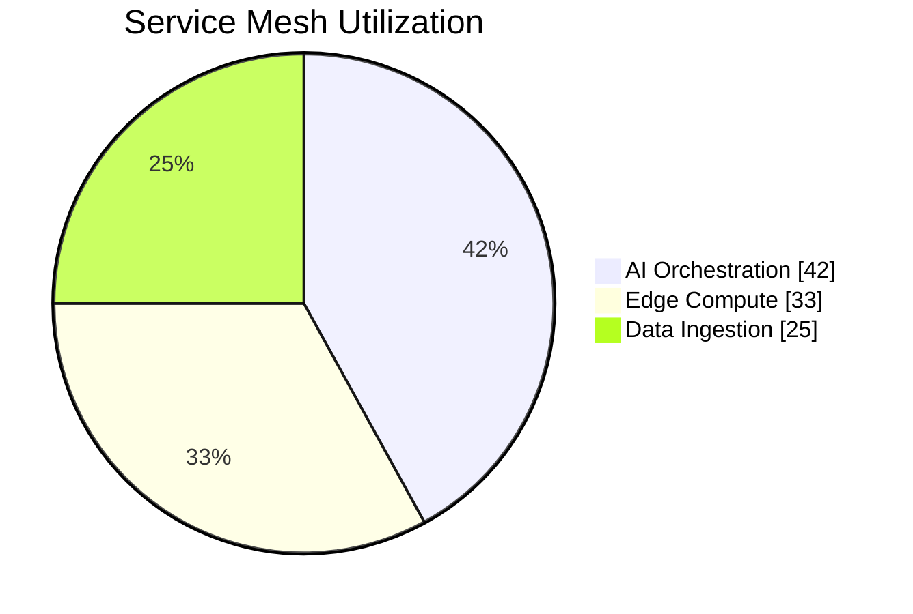

<h1 align="center">
  🌍 Industrial-Grade AI Services
   
  Powered by TMG Makerspace Africa
</h1>

  
  
  

## 🛠️ Core Stack

| **Category**       | **Technologies**                                                                 |
|---------------------|---------------------------------------------------------------------------------|
| **ML Operations**   | Kedro • MLflow • Kubeflow • TensorFlow Extended                                |
| **Cloud Native**    | AWS IoT Greengrass • Azure Arc • Google Anthos                                 |
| **Data Fabric**     | Delta Lake • Apache Iceberg • AWS Glue                                        |
| **Security**        | HashiCorp Vault • AWS IAM • Azure Sentinel                                    |

## 🚀 Live Demos

  
  

## 📈 Performance Metrics

## Hi, I'm Sudhir! 👋🏾

Welcome to my GitHub profile! I'm passionate about transforming data science experiments into production-ready solutions, particularly in the challenging and diverse context of Africa. As part of TMG Makerspace Africa, I'm committed to building resilient and innovative AI infrastructures. 

  
  
  
  

## 🎯 Mission

**We're not just reducing technical debt – we're eliminating it.** Based at TMG Makerspace Africa, we're revolutionizing how data science experiments transform into production systems. Our solutions are battle-tested in the challenging South African context, making them resilient enough for any environment.

## 💥 What Sets Us Apart

- ⚡ **Zero-Compromise ML Ops**: Production-ready from day one
- ⚡ **Ruthless Efficiency**: Cut experiment-to-production time by 60%
- ⚡ **Built for Africa**: Designed for our unique infrastructure challenges
- ⚡ **Scale-Ready**: From prototype to continental deployment

## 🛠️ Game-Changing Solutions

- 🔧 **Experiment Management**: Version control that actually works for data science
- 🔧 **Quality Enforcement**: Automated guardrails for technical excellence
- 🔧 **Self-Healing Pipelines**: Adaptive infrastructure that grows with you
- 🔧 **Resource Optimization**: Maximum impact, minimum waste
- 🔧 **Production-Grade ML**: Deploy with absolute confidence

  <em>Building Africa's AI Future</em>

## ⚡ Power Tools

  
  
  
  
   
  
  
  
  
   
  
  
  
  
   
  
  
  

## 🚀 Flagship Solutions

| Solution | Description |
|----------|-------------|
| ⚡ **4o Experiment Manager** | The last ML experiment tracker you'll ever need |
| 🛡️ **Technical Debt Shield** | Stop technical debt before it starts |
| 🔥 **Production Pipeline Builder** | From notebook to production in minutes, not months |
| 📊 **Analytics Command Center** | Total visibility into your ML operations |
| ⚡ **Resource Optimizer** | Maximum performance, minimum spend |
| 🧩 **Project IDX** | Integrated development experience for seamless collaboration and deployment |
| 🖼️ **pix2tex** | Using a ViT to convert images of equations into LaTeX code |

## 🌍 Our Impact Zone

- 🏢 **Database Management Systems (DBMS)**: Comprehensive database management services for optimal performance, security, and POPIA compliance
- 🌍 **MySQL Services**: Reliable MySQL solutions tailored for South African businesses
- 🎯 **PostgreSQL Services**: Advanced PostgreSQL solutions for businesses

## 🏆 Achievements & Certifications

  
Click to see what excellence looks like

  
  - 🎓 [Microsoft Azure AI Engineer Associate](https://learn.microsoft.com/en-us/certifications/azure-ai-engineer/)
  - 🎓 [Microsoft Certified: Azure Solutions Architect Expert](https://learn.microsoft.com/en-us/certifications/azure-solutions-architect/)
  - 🎓 [Certified Information Systems Security Professional (CISSP)](https://www.isc2.org/Certifications/CISSP)
  - 🏆 [Red Bull Basement National Finalist 🇿🇦](https://www.redbull.com/za-en/events/red-bull-basement)
  - ⚡ [Microsoft Founders Hub - Level 3](https://www.microsoft.com/startups/founders-hub)
  - 🎓 [Microsoft Certified: Azure Fundamentals](https://learn.microsoft.com/en-us/certifications/azure-fundamentals/)
  - 🎓 [Microsoft Certified: Azure AI Fundamentals](https://learn.microsoft.com/en-us/certifications/azure-ai-fundamentals/)
  - 🎓 [Microsoft Certified: Power Platform Fundamentals](https://learn.microsoft.com/en-us/certifications/power-platform-fundamentals/)
  - 🚗 [AWS DeepRacer Championship Participant](https://aws.amazon.com/deepracer/)
  - ☁️ [AWS Cloud Practitioner](https://aws.amazon.com/certification/certified-cloud-practitioner/)
  - 🎓 [Microsoft Certified Solutions Developer (MSCD): SQL Server 2016](https://www.microsoft.com/en-us/learning/mcsd-sql-2016-certification.aspx)

## 💻 Tech Stack

  
  
  
  
   
  
  
  

## 📊 GitHub Stats

  

## 🤝 Connect With Me

  
  
  
  

   
  🏢 <a href="https://g.co/kgs/CKQ5KiE">Transwerke, Braamfontein, Johannesburg, 2017</a>
   
  🚀 Innovation Hub: <a href="https://tmgmakerspace.africa">tmgmakerspace.africa</a>
    
  
    
  

